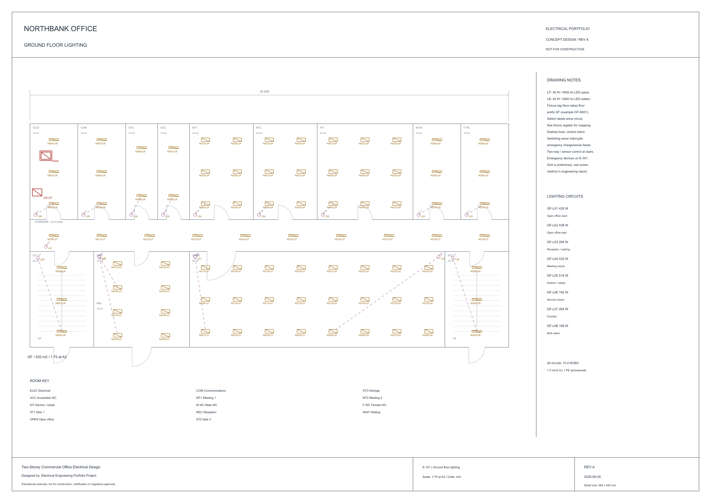
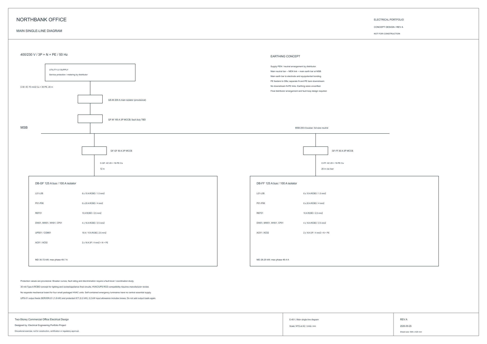

# Northbank Office - Electrical Design Portfolio

A conceptual electrical design for a fictional Australian two-storey commercial office. Each floor is 30 x 14 m (420 m2), giving 840 m2 gross floor area.

**This project is an educational electrical engineering portfolio exercise and is not intended for construction, certification, or regulatory approval.**

## Start here

- [Engineering report](docs/engineering-report.md)
- [Design assumptions](docs/design-assumptions.md)
- [Calculation methods and worked examples](docs/calculations.md)
- [Validation record](docs/validation.md)

## Design scope

Normal and emergency lighting, exit signs, general and dedicated power, radial floor distribution, phase balancing, cable-route concepts, main SLD, schedules and explanatory calculations. The supply is 400/230 V three-phase, 50 Hz. MSB separately feeds DB-GF and DB-FF.

Connected load is 75.104 kW. Assumed maximum demand is 58.964 kW, with highest diversified phase current 92.02 A. See the report for the assumptions and limits of these figures.

## Software and file format

LibreCAD is the target CAD editor. Drawings use editable ASCII DXF R12 entities: LINE, CIRCLE, TEXT and INSERT/BLOCK. Geometry is authored by the included Python standard-library generator, avoiding proprietary CAD features and external dependencies. A JavaScript Artifact Tool exporter writes the requested numeric CSV schedules. SVG/PNG renders are provided for review.

The DXFs use **A2 sheet coordinates in model space**. Floor plans are plotted at 1:75, or 1:125 where marked. To convert a measured plan distance to real millimetres, multiply by the stated denominator. Text, symbols and title blocks are in plotted millimetres. This choice prioritises portable LibreCAD sheet editing and printing; it is not a full-size architectural BIM model.

## Drawings

| Sheet | Drawing | DXF |
| --- | --- | --- |
| E-001 | Cover and drawing index | [Open](drawings/E-001-cover.dxf) |
| E-002 | Symbols and general notes | [Open](drawings/E-002-symbols.dxf) |
| E-101 | Ground floor lighting | [Open](drawings/E-101-ground-lighting.dxf) |
| E-102 | First floor lighting | [Open](drawings/E-102-first-lighting.dxf) |
| E-201 | Ground floor power | [Open](drawings/E-201-ground-power.dxf) |
| E-202 | First floor power | [Open](drawings/E-202-first-power.dxf) |
| E-301 | Emergency lighting and exit signs | [Open](drawings/E-301-emergency-lighting.dxf) |
| E-401 | Main single-line diagram | [Open](drawings/E-401-single-line-diagram.dxf) |
| E-501 | Distribution board schedules | [Open](drawings/E-501-panel-schedules.dxf) |
| E-601 | Cable routing and riser | [Open](drawings/E-601-cable-routing.dxf) |

Open a DXF in LibreCAD using File > Open, then View > Auto Zoom if needed. Use the layer list to isolate systems and the block list to reuse symbols. For printing, set A2 landscape, 1:1 paper scale and check the border fit in print preview. Do not apply an additional 1:75 print reduction.

## Engineering calculations and schedules

`schedules/` contains DB, equipment, cable, load, fixture, outlet and emergency registers. `calculations/` contains load totals, phase allocations, cable screening and room lumen-method results. CSVs are static numeric snapshots; formulae and source assumptions are documented and the Python model recalculates them.

## Screenshots and previews

All drawing sheets also have SVG previews, which remain crisp at high zoom.

## Reproduce or edit

Use Python 3.12 or newer for the complete generation workflow.

1. Edit `scripts/design_data.py` for rooms, loads, devices and allocations.
2. Run `python scripts/generate_drawings.py`.
3. Run `python scripts/generate_engineering.py`.
4. In an environment with `@oai/artifact-tool`, run `node scripts/export_schedules.mjs`.
5. Run `python scripts/validate_project.py` for file/data consistency.
6. Inspect changed drawings in LibreCAD. Regenerate PNG previews from the SVGs with an SVG renderer if desired.

For environments without Artifact Tool, `python scripts/export_csv_fallback.py` reproduces the same requested CSV snapshots from the generated table data using the standard library.

Direct LibreCAD edits remain editable, but a generator rerun replaces the generated DXFs. Preserve a separate working revision before regenerating. Git may be used to track source and drawing revisions; this package is not automatically published.

## Skills demonstrated

Electrical CAD drafting, circuit allocation, lighting calculations, demand estimation, phase balancing, conceptual cable sizing, panel schedules, SLDs, cable routing and clear engineering documentation.

## Limitations

No compliance certification or construction suitability is claimed. Cable ampacities are illustrative inputs, equipment ratings are assumed, and photometric/fault/earthing/coordination studies remain incomplete. Architecture, fire/egress and accessible inter-floor access also require specialist review. See the report for the complete scope boundary.
